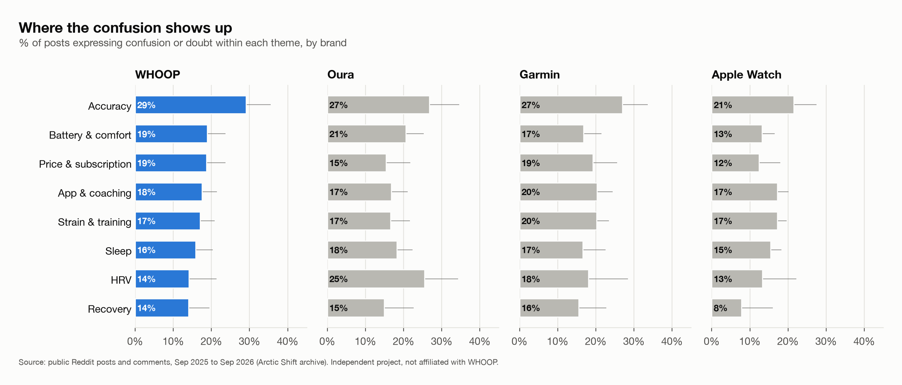
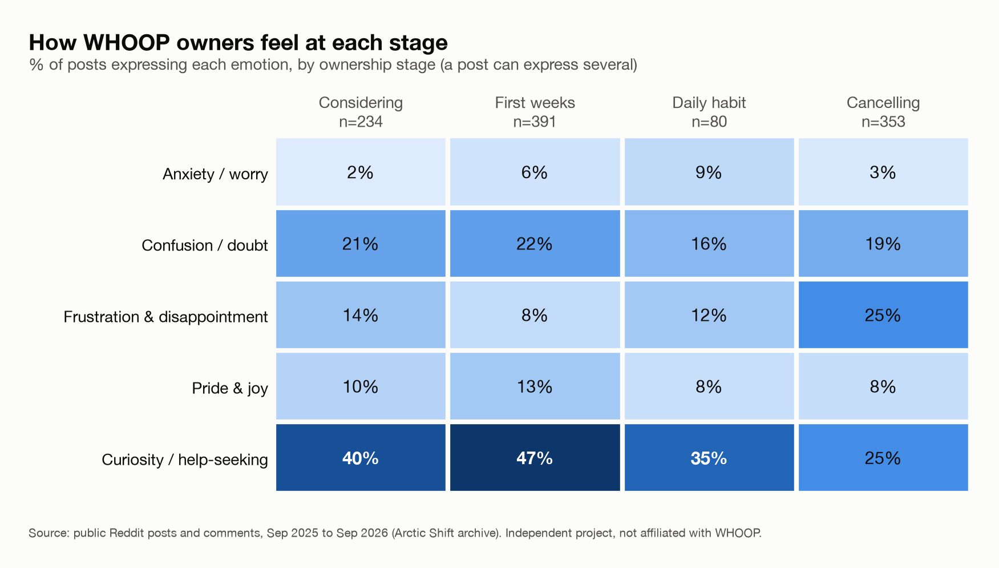
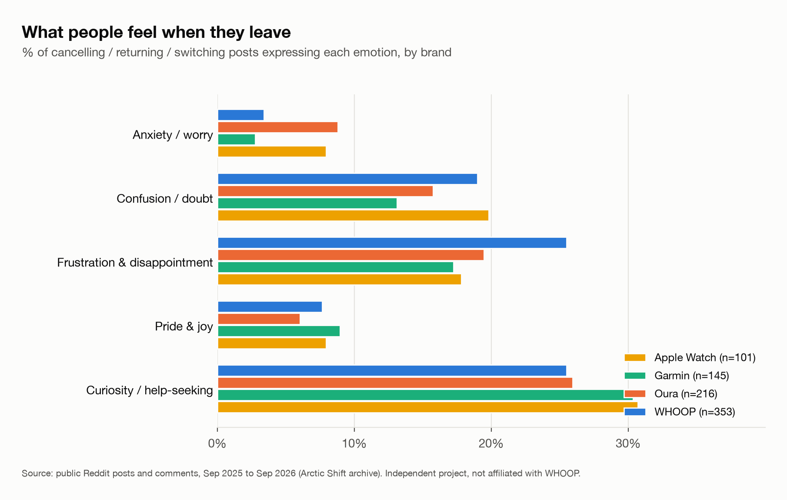

# Empowerment vs. Anxiety: The Emotions Behind Fitness Wearables

*An independent student project. Not affiliated with, sponsored by, or endorsed by WHOOP, Oura, Garmin or Apple.*

**Question:** Which emotions are associated with adopting, keeping and abandoning a fitness wearable, and how could WHOOP build its brand around empowerment rather than anxiety?

**Data:** 10,406 public Reddit posts and comments from r/whoop, r/ouraring, r/Garmin and r/AppleWatch, Sep 28, 2025 to Sep 28, 2026, collected through the [Arctic Shift](https://github.com/ArthurHeitmann/arctic_shift) public Reddit archive.

**Deliverables:** this analysis, a one-page campaign concept ([Sync Up brief, PDF](docs/campaign_brief_sync_up.pdf)), and full [method notes](docs/method_notes.md).

## Results

### 1. The problem is doubt, not fear

Confusion or doubt shows up in about **16% of posts for every brand**. Anxiety shows up in only **3–6%**, and that's an upper bound, because the worry word list over-counts. Confusion peaks on accuracy: **29% of WHOOP accuracy posts** express confusion.



### 2. The first month is the most engaged and the most unsure

In WHOOP's first-weeks posts, **47% ask for help** and **22% express confusion**. Pride & joy is also at its highest here (**12.8%**). That first month overlaps WHOOP's own 30-day calibration period ([WHOOP Support](https://support.whoop.com/hc/en-us/articles/360057137353-What-to-Expect-in-Your-First-30-Days)).



### 3. Exits are about friction and value, not data anxiety

Frustration & disappointment appears in **25.5% of WHOOP cancelling posts**, against 8–14% at every other stage. Price is named as a reason in 36% of WHOOP exits (indicative only). In 24 hand-checked WHOOP exit posts, **13 described trouble cancelling, returning a trial or being billed**.



### What the data did not support

- **Anxiety did not fade with use** for WHOOP: 6.1% in first weeks vs 8.8% in daily habit (p = 0.39).
- **Pride did not grow with use**: 12.8% in first weeks vs 7.5% in daily habit (p = 0.18).

These results moved the campaign away from "reduce anxiety" and toward "explain the numbers". The full test table is in [`outputs/tables/hypothesis_tests.csv`](outputs/tables/hypothesis_tests.csv).

### Campaign concept: Sync Up

The concept turns WHOOP's 30-day calibration into a guided, celebrated first month for January joiners. It includes a Day 1–30 countdown with "why this number" explainers, a New Year's Day reset message, and a shareable Day 30 "Synced Up" card that celebrates consistency, not scores. See the [brief](docs/campaign_brief_sync_up.pdf).

## Method (short version)

1. **Collect** posts and top comments from each subreddit over the same 12 months, sampled evenly by week, plus a "stage boost" sample used only for within-stage comparisons.
2. **Clean** out duplicates, deleted posts, bots, text under 15 words and non-English text (13,162 → 10,406 rows).
3. **Label emotions** with [SamLowe/roberta-base-go_emotions](https://huggingface.co/SamLowe/roberta-base-go_emotions) (threshold 0.30). The model's 28 labels are grouped into 5 core emotions, and a worry word list is added to the anxiety group.
4. **Tag stage and theme** with transparent keyword rules: four stages (considering, first weeks, daily habit, cancelling) and eight themes (sleep, recovery, strain & training, HRV, accuracy, battery & comfort, price & subscription, app & coaching).
5. **Compare** shares with 95% Wilson intervals and two-proportion z-tests. Cells with fewer than 30 posts are flagged.
6. **Hand-check** every rule and fix what fails. Labels made sense for 85% of random posts, and stage tags were right for 95%. Results are in [`outputs/tables/handcheck_summary.csv`](outputs/tables/handcheck_summary.csv).

## Repo layout

```
docs/          problem statement, method notes, campaign brief
src/           collection, cleaning, emotion, tagging, analysis and chart code
notebooks/     analysis notebooks, run in order
data/          raw and clean data (git-ignored; not published)
outputs/       charts and aggregate tables only
```

## How to reproduce

```bash
python -m venv .venv && source .venv/bin/activate
pip install -r requirements.txt
python src/collect_reddit.py        # writes data/raw/raw_reddit.csv (~90 min)
python src/clean_data.py            # writes data/clean/clean_reddit.csv
```

Then run the notebooks in order:

- `01_setup_and_test_pull` checks the archive API.
- `02_clean_and_emotion_sample` runs the cleaning and the 200-post emotion sample.
- `03_analyze` runs the full emotion run (resumable), the tags, the tables, the tests and the charts.

## Limitations and ethics

- Reddit over-represents enthusiasts and people with complaints. Results describe these communities, not all wearable owners.
- Findings are associations, not causes.
- Emotion labels come from a model and can be wrong. The worry word list is right about 70% of the time, so anxiety shares are an upper bound.
- Cancelling tags were right for 70% of WHOOP posts but only 20% of Garmin posts. Exit findings therefore use within-WHOOP comparisons, not brand comparisons.
- Data comes from a third-party archive of public Reddit content, not Reddit's official API.
- No usernames are collected or stored. Only aggregate results are published. Raw post text, including hand-check sheets, is not in this repo, and no post is quoted.

## AI tools used

- **Hugging Face model** ([SamLowe/roberta-base-go_emotions](https://huggingface.co/SamLowe/roberta-base-go_emotions)): emotion labels for every post.
- **Claude (Anthropic)**: helped plan the project, write and debug the Python code, propose hand-check calls with a written reason for each (I reviewed every one), and draft the campaign brief. I made the research and creative decisions, including the hypotheses, the emotion groups, the campaign direction and the Sync Up name, and I checked every number that's reported.
